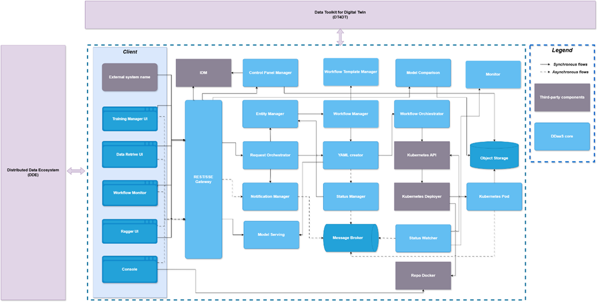

# Architettura

L'architettura in figura fa riferimento alla sezione denominata DDaaS (racchiusa all'interno del rettangolo tratteggiato), ovvero la parte della piattaforma dedicata ai servizi di analisi dati distribuita. Come visto in precedenza, questa sezione è affiancata al DDE poiché i due ambienti cooperano nella condivisione dei dati e dei flussi informativi. 

Come mostrato nell'immagine, la sezione comunica con il DT4DT per permettere a utenti e piattaforme esterne di accedere ai servizi e alle funzionalità disponibili.

Entrando nel dettaglio del DDAaS specifichiamo che l’infrastruttura si appoggia si appoggia su un’architettura a microservizi. L’architettura orientata ai microservizi offre numerosi vantaggi rispetto ai sistemi monolitici, tra cui la maggiore scalabilità, l’isolamento dei guasti, la facilità di implementazione, il time-to-market rapido, la sicurezza dei dati, la facilità di sperimentazione e la resilienza. 

Nel caso specifico del DDaaS è stato adottato l'*API Gateway pattern*, dove un componente gateway fornisce un punto d'ingresso unificato verso i microservizi core, semplificando l'accesso e garantendo una comunicazione fluida tra client e servizi. Questo approccio offre diversi vantaggi: una comunicazione più snella, una sicurezza rafforzata e una gestione ottimizzata dei servizi del sistema. Il pattern permette inoltre di centralizzare funzionalità trasversali come autenticazione, logging e rate limiting in un unico punto, migliorando la coerenza e minimizzando le ridondanze.

Sulla parte sinistra del DDaaS sono rappresentati alcuni client che fruiscono i servizi messi a disposizione dai componenti di backend. Tra questi troviamo componenti generici come *console* e c*lient REST*, e interfacce grafiche sviluppate ad hoc per offrire un’esperienza utente focalizzata sulla funzionalità offerta. Ad esempio allo scopo di agevolare la gestione di asset (come: Dataset, Modelli di ML) e flussi dati. Tra queste troviamo, un designer che permette di creare workflow di microservizi per l'addestramento di Modelli di ML, un altro strumento gestisce la knolege base di RAG, un altro consente di fruire di servizi di MLOps e così via. I componenti non saranno accessibili solo attraverso client UI, ma attraverso API REST (utilizzabili da sistemi esterni come "External system" nell’immagine) o da altri client come la “console”, per la gestione delle immagini docker su un repository dedicato.

I componenti sono deployati su un cluster orchestrato da kubernetes, le autorizzazioni e le autenticazioni (così come anche per i componenti del DDE) sono gestiti da unico identity management system, keycloak. 

Per una maggior comprensione dell’immagine dei componenti core del DDAaS, identifichiamo le aree di appartenenza dettagliando le principali funzionalità di ogni componente:

I componenti utili nelle fasi di addestramento dei modelli e che ne curano il ciclo di vita sono:

Workflow template manager: consente la gestione di workflow pre-configurati (template) allo scopo di agevolare futuri utenti in casi d’uso simili a quelle già analizzati. 

Workflow Manager: si occupa di offrire servizi per la gestione dei workflow di micorservizi

YAML Creator: Responsabile della conversione/creazione dei file per il deploy secondo le necessità dei microservizi che compongono il workflow

Workflow orchestrator: è responsabile della fase di deploy dei dei microservizi che compongono il workflow

Model serving: gestisce la fase di deploy del modello addestrato.

Model composition: Strumento che consente il confronto delle metriche dei modelli

Monitor: consente di monitorare il dettaglio dell’esecuzione dei micorservizi

Status Manager: grazie alle notifiche dello status watcher interpreta e controlla gli stati dei workflow.

Il kubertetes pod che vediamo all’estrema destra dello schema rappresenta il singolo microservizio che appartiene ad un workflow. L’immagine è reperita da un repository docker. Inoltre, come si evince può accedere allo Object storage messo a disposizione sulla piattaforma (ad esempio per la lettura e scrittura di dataset e modelli) e di scrivere informazioni attraverso flussi streaming (appoggiandosi ad un message brocker) allo scopo di fornire all’utente che sta monitorando l’esecuzione informazioni provenienti dall’interno del pod, (come immagini, log, etc).

Entity Manager: Ha la responsabilità di gestire i metadati delle entità che fruiscono dai componenti.

CHAT-GPT

Sì, posso estendere la descrizione con **ulteriori dettagli tecnici e funzionali**, mantenendo coerenza con lo stile e la struttura del testo attuale. Di seguito ti propongo una **versione ampliata**, con l’aggiunta di concetti utili a migliorare la comprensione architetturale e a evidenziare punti di forza e possibili estensioni future:

---

L'architettura mostrata in figura fa riferimento alla sezione denominata **DDaaS** (*Distributed Data Analytics as a Service*), evidenziata all’interno del rettangolo tratteggiato. Essa rappresenta la componente della piattaforma dedicata all’esecuzione, gestione e orchestrazione di servizi analitici distribuiti. Il DDaaS è progettato per cooperare con l’ambiente **DDE** (*Data-driven Environment*), con cui condivide modelli informativi, dataset, e canali di comunicazione. Tale interazione favorisce l’integrazione tra la produzione e il consumo di dati lungo tutta la catena del valore informativo.

La sezione DDaaS è esposta all’esterno tramite il **DT4DT** (*Digital Twin for Digital Thread*), che funge da strato di interoperabilità e accesso per piattaforme terze, utenti esterni o sistemi verticali. Ciò consente di integrare facilmente i servizi analitici della piattaforma con scenari operativi reali o ambienti digital twin.

A livello infrastrutturale, il DDaaS si basa su un’**architettura a microservizi containerizzati**, orchestrata attraverso **Kubernetes**. Ogni microservizio è pensato per essere scalabile, isolato, e facilmente aggiornabile. L’adozione dell’**API Gateway Pattern** introduce un livello intermedio che centralizza tutte le richieste verso i microservizi: questo migliora la sicurezza, semplifica la gestione della comunicazione tra client e backend, e consente di accorpare funzionalità trasversali come **autenticazione**, **autorizzazione**, **logging**, **rate limiting**, e **monitoraggio centralizzato**.

I servizi della piattaforma sono accessibili sia tramite **interfacce grafiche dedicate** (per utenti finali), sia tramite **API REST** (per client software esterni, sistemi di orchestrazione o strumenti DevOps). L’accesso è regolato da un sistema centralizzato di **identity & access management**, basato su **Keycloak**, che fornisce funzionalità di autenticazione SSO, gestione di ruoli, permessi e token JWT condivisi tra tutti i moduli (DDaaS e DDE).

---

### 🧩 Componenti core del DDaaS – funzionalità principali

### 1. **Workflow e orchestrazione**

- **Workflow Template Manager**: gestione di template riutilizzabili per scenari ML ricorrenti.
- **Workflow Manager**: gestisce la definizione e la validazione dei flussi di microservizi.
- **YAML Creator**: genera i manifest Kubernetes (in formato YAML) per il deploy dinamico dei servizi definiti.
- **Workflow Orchestrator**: responsabile della generazione e attivazione dei job tramite API Kubernetes, interfacciandosi con l'orchestratore della piattaforma.

### 2. **Esecuzione e serving**

- **Model Serving**: esegue il deploy dei modelli ML addestrati su endpoint servibili.
- **Model Composition**: consente il confronto dei modelli in termini di metriche e prestazioni, supportando logiche di selezione automatica.
- **Monitor**: raccoglie e visualizza eventi, log, immagini e output provenienti dai container eseguiti.
- **Status Manager**: mantiene lo stato coerente del workflow, reagendo a notifiche in tempo reale inviate dallo **Status Watcher**.

### 3. **Storage e streaming**

- Il **Kubernetes Pod** rappresenta l’unità base di esecuzione. Ogni Pod:
    - scarica la propria immagine da un **Docker Registry**;
    - accede a un **Object Storage** distribuito (es. MinIO, S3) per leggere/scrivere dataset e modelli;
    - comunica tramite **Message Broker** (es. Kafka o NATS) per inviare aggiornamenti real-time all’utente, inclusi log, output intermedi, immagini o eventi.

### 4. **Gestione entità e metadati**

- **Entity Manager**: mantiene il catalogo aggiornato delle entità gestite dalla piattaforma (dataset, modelli, flussi), con metadati tecnici e semantici.

---

### 🔭 Estendibilità e evoluzioni future

L’architettura del DDaaS è progettata per supportare scenari evolutivi, tra cui:

- **AutoML**: introduzione di moduli per l’ottimizzazione automatica dei modelli.
- **Federated Learning**: supporto all’addestramento distribuito su nodi decentralizzati.
- **Explainable AI (XAI)**: integrazione di componenti per la spiegabilità dei modelli.
- **Edge Deployment**: estensione del modello di deployment anche su ambienti periferici (edge/IoT), mantenendo controllo e osservabilità.

 

 

[**HOME**](../ALIDA%20AGRITECH.md)