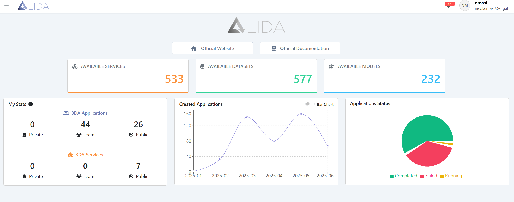

# Dashboard 

The ALIDA homepage displays some general information. In the upper-left
corner, there is a link to the ALIDA Official Website, where you can
find information on core functionalities, the technologies used, and
projects where ALIDA has been applied. In the upper-right corner, you'll
find the link to the Official Documentation. * Home Page -
DASHBOARD*.

On the left side of the screen, there is a panel showing the number of
Available Services (representing the number of BDA Services in the
catalogue), Available Datasets (the number of Datasets registered in
ALIDA), and Available Models (the number of models registered in ALIDA).

In the lower-left corner, the My Stats panel shows your BDA Applications
and BDA Services, categorized by their visibility level as Private,
Team, or Public.

> *Home Page - DASHBOARD*

In the center of the screen, a panel displays a graph of Created
Applications, indicating how many Applications have been created over
time.

Finally, the panel on the right presents the Application Status in a pie
chart, showing possible statuses: completed, failed, and running.